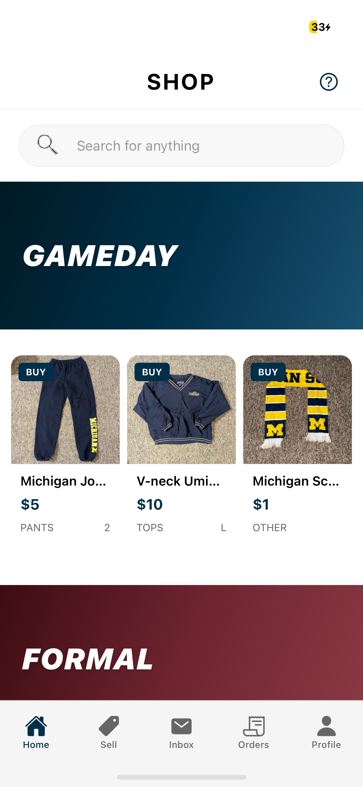
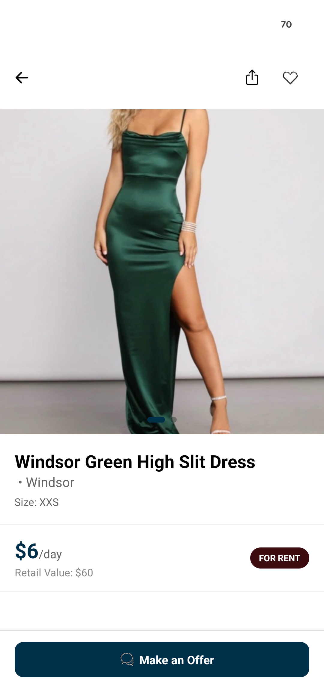
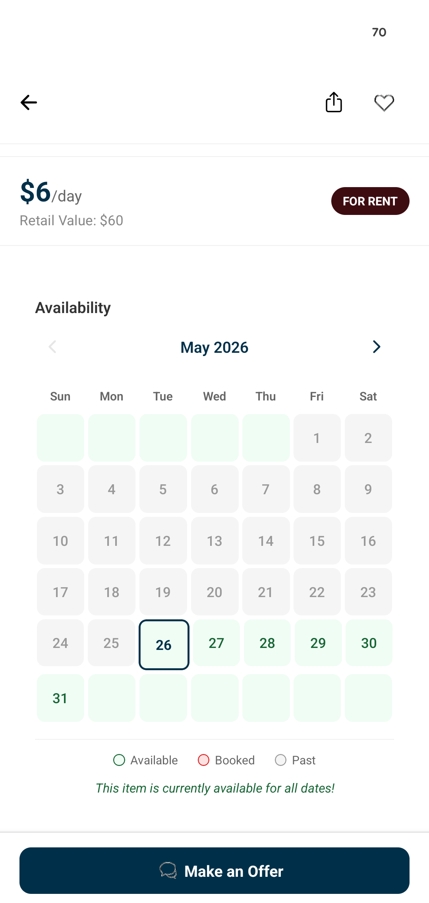
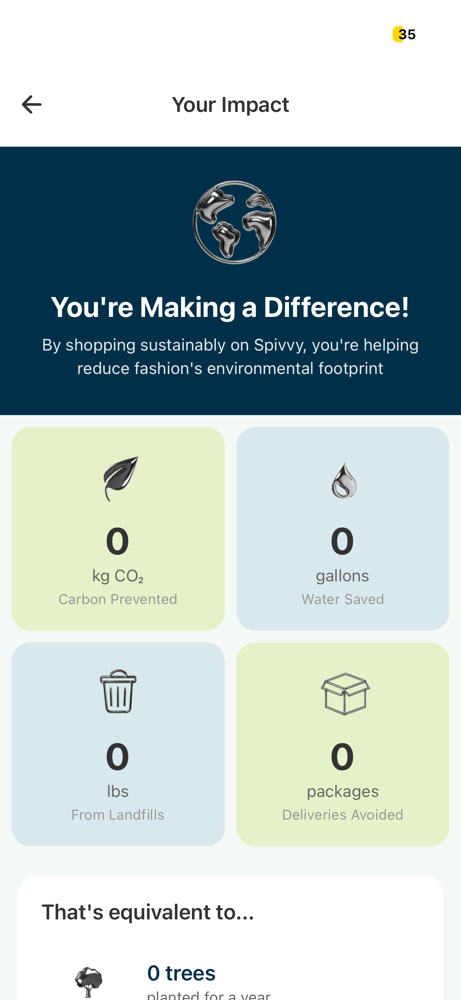

# Spivvy

A peer-to-peer marketplace for U.S. college students to **buy, sell, and rent** clothing from people at their own school. Hyper-local, .edu-verified, no shipping. Browse what your campus is selling or renting, message the seller, and meet up.

**Built solo. Live on iOS and Android since March 2026. ~230 users and 200+ listings at the University of Michigan, with early traction at Grand Valley State University. 71.4% App Store conversion rate (vs. ~30% industry average).**

[App Store]([APP_STORE_URL](https://apps.apple.com/us/app/spivvy/id6759763491)) · [Play Store]([PLAY_STORE_URL](https://play.google.com/store/apps/details?id=com.taylorlane.spivvy)) · [spivvy.app](https://spivvy.app)

  

## What it is

College students move every year, want what their friends are wearing, and have closets full of stuff they'll never wear again. eBay is too broad, Facebook Marketplace is too sketchy, Depop has shipping costs and strangers, and resale apps in general aren't built for the rhythm of a campus.

Spivvy is. Every listing is from someone at your school, every transaction is in person, and every user is verified by their .edu email before they can list, buy, or rent. The rental option matters in particular for things like formal dresses, game-day outfits, and Halloween costumes. It's perfect for items students need once and would rather not pay full price for.

## Tech stack

- **Mobile:** React Native + TypeScript with Expo (file-based routing)
- **Backend:** Supabase — Postgres, Auth, Storage, and 8 Edge Functions for Stripe flows, push notifications, scheduled cleanup jobs, and account management
- **Payments:** Stripe + Stripe Connect — full marketplace flow with manual-capture PaymentIntents (escrow), `setup_future_usage: off_session` to save cards for post-rental damage charges, and Connect transfers to sellers
- **Images:** `expo-image-manipulator` for client-side compression, `expo-image` for disk-cached display
- **Push notifications:** Expo push
- **Error tracking:** Sentry
- **Auth:** .edu enforcement — users pick their school from a list and type only the local part of their email; the domain is appended automatically

## Screenshots

  
  
  

  
  
  

*Top row: shop home with campus-themed collections, .edu sign-up, browse view. Bottom row: rental listing showing per-day pricing and retail value, availability calendar with booked/available/past states, and the personal sustainability dashboard tracking carbon, water, landfill diversion, and packaging avoided.*

## Engineering challenges worth talking about

### .edu verification, three iterations deep

The whole product depends on every user actually being a college student, which means verifying their .edu email at sign-up has to work and has to be hard to fake. The first version sent a magic link: click the link, and you're verified. Then I discovered that Google's email security was automatically clicking links in the background to scan them for phishing, which "verified" anyone with a Gmail account before they even opened the email.

I rebuilt it as a code-based flow: user types in their email, gets a 6-digit code, types it in. That fixed the Google auto-verify problem but introduced a new one. Apple's mail filter started routing some of my codes to spam. That took a few rounds of sender domain configuration and message tuning to clean up. The final version is solid, but the lesson stuck: auth flows that look identical on paper can have very different failure modes depending on who's running the inbox.

### The counter-offer routing problem

Marketplace logic is the kind of thing that looks trivial until you write it. An offer is a many-to-many object: buyer A makes an offer to seller B, seller B counters, buyer A counters back, multiple buyers can have parallel offer threads on the same listing, and each user should only ever see the offers that involve them. Getting that data model right and getting the queries to return *just the offers visible to the current user with the correct latest state* was one of the harder parts of the app to debug, especially once notifications and read receipts were layered in.

### Designing the rental return + damage claim flow

The rental side of the product is where most of the interesting state machine work lives. A rental moves through reservation → meetup → in-possession → return-due → returned → either closed or disputed. Each transition fires its own logic (push notifications, late fee accrual, escrow capture, dispute eligibility windows). Getting that flow correct meant treating rentals as a finite state machine rather than a series of independent transactions.

The damage claim flow on top of that is the part I'm most proud of:

- At checkout, the buyer's card is saved via Stripe's `setup_future_usage: 'off_session'`, so the platform can charge it later without the buyer being present.
- If a seller files a damage claim after a rental return and my team resolves it in the seller's favor, the buyer's saved card is charged off-session for the damage amount.
- The damage payout is held for 7 days before being transferred to the seller — handled by a daily cron job (`release-damage-claims`) running as a Supabase Edge Function. The hold period gives the buyer time to escalate if they disagree.
- The platform takes a 5% cut on damage claim payouts.

One clever edge case worth surfacing: **late fees on overdue returns are frozen at the moment a dispute is opened.** Without this, a buyer disputing a legitimate issue would still rack up compounding daily late fees while their case sat in manual review. Freezing the fees protects them from a bad outcome they didn't choose, and unfreezing happens only if the dispute is dismissed.

### The production-build-only crash

At one point, everything ran perfectly in development and crashed instantly on production. No error, no log, no Sentry event, just force-quit the moment the splash screen finished. The only way to debug it was to wire my phone to my laptop and read native logs in real time as the app died. Turned out to be an Expo plugin that worked in dev mode but didn't survive the production bundling step. The fix took an hour but finding it took two days.

## Product decisions and the reasoning behind them

### Mobile-first, not mobile-only-by-accident

Spivvy is an app, not a website. Not because mobile is trendy, but because college students shop on their phones. Whether it be in line at the dining hall, walking between classes, or lying in bed avoiding homework, they're not opening a laptop to browse a marketplace. Building mobile-first also meant verification could happen on the device the user actually carries, which mattered for the trust model: I want the person buying your sweatshirt to be the same person who showed up at the meetup spot. A web version is on the roadmap eventually, but not as the primary surface.

### No shipping, by design

Every transaction is in person on or near campus. No shipping fees on a $15 sweater, packaging time for the seller, or lost packages or "it never arrived" disputes. Most importantly, there's no carbon footprint from cross-country resale. Meetups are easy, as campus buildings are a five-minute walk from where most students live. The constraint also makes the product *different* from Depop and Poshmark in a way that matters: Spivvy scales school by school, not nationally, and the local-only model creates a stronger sense of community than any cross-country resale platform can.

### Hyper-local to campus, not "all college students everywhere"

You don't buy a sweater from a stranger 1,500 miles away with the same comfort you buy from someone in your dorm. Keeping the marketplace bound to a single campus means buyers can browse items they actually want to wear (campus style is hyper-local), trust the seller (same school, same .edu, often mutual friends), and meet up without logistics overhead. It also means I can launch one campus at a time and let real density build before expanding.

### Rental as a first-class flow, not a bolt-on

Most resale apps don't do rentals because the operational complexity (returns, damage, late fees, disputes) is meaningfully harder than one-shot sales. I built rentals in from the start because the use case is too good to ignore: students need formal dresses, game-day fits, and Halloween costumes once and don't want to pay $200 for something they'll wear for four hours. Renting their friend's dress for $20 is a better product than buying a new one or buying a used one they'll never wear again. The hard work was building the return flow, the dispute system, and the off-session damage charge mechanics so that sellers feel safe lending their stuff.

### Sustainability isn't a side benefit, it's a stated mission

College campuses generate an enormous amount of clothing waste every year. Seniors graduate, leases end, dorms empty out, and clothes go into dumpsters. Spivvy turns that waste stream into next semester's inventory. This isn't just marketing copy; it's the reason users sign up. Branding around sustainability also opens doors that pure commerce branding doesn't: sorority philanthropy partnerships, campus sustainability orgs, and fashion magazine collabs all happen more easily when the product has a real environmental story.

### Buyer pays the fee, not the seller

Most marketplaces charge the seller. I do the opposite: buyers pay roughly one extra dollar on top of the listed price, and sellers receive 100% of what they listed for. The reasoning is that listings are the hard side of a two-sided marketplace. Without sellers, there's nothing to buy. Removing every friction point from listing (no seller fees, no shipping, no packaging) makes sellers willing to post things they'd otherwise toss. Buyers don't mind the small fee because it covers payment security and convenience, which they're used to paying for elsewhere (think DoorDash fees on a $12 burrito).

### Stripe manual-capture for escrow

When a buyer pays, the charge is authorized but not captured until the meetup is verified. If the meetup doesn't happen or the item isn't as described, the hold is released without the seller ever seeing the money. This is closer to how Airbnb handles deposits than how typical e-commerce works, and it's what makes "no shipping, in-person meetup" feel safe to first-time users. The money is real and committed, but it doesn't move until the transaction actually completes.

### A two-track dispute system, not one-size-fits-all

Sales disputes and rental damage claims look superficially similar (both involve evidence, manual review, and money moving), but the failure modes are completely different. A sales dispute is about whether the buyer got what they paid for. A damage claim is about whether the seller's item came back in the condition it left in. Treating them as one flow would have meant the worst of both — too rigid for one, too loose for the other. So I built two parallel paths:

- **Transaction disputes** (buyer-initiated): reasons include item-not-as-described, item-not-received, wrong-item, no-show. Buyer submits a written description plus photos to Supabase Storage. State: `pending → under_review → resolved` (in buyer's or seller's favor) or `dismissed`.
- **Damage claims** (seller-initiated, rentals only): seller specifies a dollar amount, reason, and evidence. Goes through the same manual review path, but resolution triggers the off-session card charge described above.

Both paths share the same manual-review interface on my end. Splitting them at the data layer let me keep each flow focused on the real questions it has to answer.

### Schema for .edu enforcement

Schools are a controlled list, not a free-text field. Users pick from the list, then enter only the local part of their email. The domain gets appended server-side. This prevents typos, prevents users from inventing fake "@yale.com" addresses, and lets me launch new schools by adding one row.

## What I'd do differently

- **Build the offer/counter-offer system from a real data model first.** I iterated on it from a simple "offer record" mental model, and the complexity kept catching me off guard. A few hours of schema design upfront would have saved a few weeks of incremental fixes.
- **Set up Sentry on day one.** I added it after launch, which means the early bug reports were "the app crashed" with no other context. Sentry should have been in the first commit.
- **Model rentals as a state machine from the start.** I built rentals as a series of independent transactions and ended up refactoring toward an explicit state machine. Doing it in that order cost weeks.
- **Test production builds earlier and more often.** Dev mode hides a lot.

## Status

Live and growing. In-app meetup scheduling is shipped; the next update adds Google Calendar integration so users can drop a meetup into their calendar in one tap. Currently focused on University of Michigan with early users at Grand Valley State. The roadmap is more schools, the calendar integration, a "recommended for you" page, and a verified-seller badge system for power sellers.
